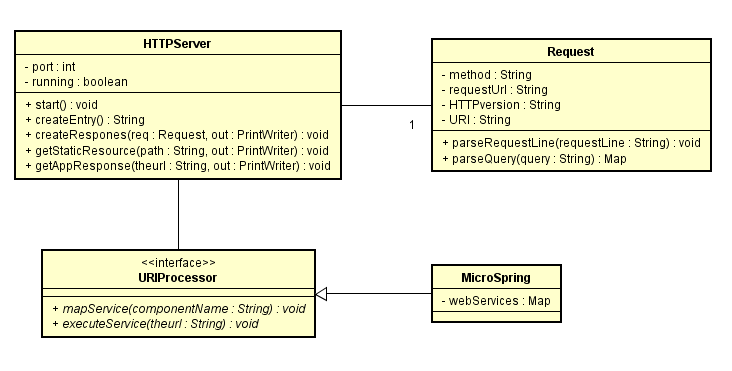

# MicroSpring #

## Prerrequisitos ##

La persona que quiera utilizar este programa debe tener conocimientos básicos en Java y Maven, además debe estar familiarizado con el patrón IoC.

Para compilar y ejecutar este programa se debe contar con las siguientes herramientas: 

- Java 8
- Maven 


## Herramientas utilizadas para el desarrollo ##

Para el desarrollo de este programa se utilizó: 

- Java: Fue el lenguaje de programación utilizado para el desarrollo.

- Maven: Fue la herramienta utilizada para la gestión y construcción del programa.


## Descripción ## 

Este es un programa que tiene dos objetivos: implementar un servidor web capaz de responder a solicitudes, tanto de recursos estáticos como dinámicos, y además, se busca realizar una inyección de dependencias con el objetivo de volver al servidor más flexible y más fácil de adaptar.

## Modelo ##


En el modelo se puede observar una interfaz llamada "URIProcessor", que es la que define cómo se debe comportar una clase que busque atender las solicitudes a recursos dinámicos (en nuestra arquitectura, la solicitudes a recursos dinámicos son aquellas que su paht inicia con "/Apps"). En el caso de nuestro programa solo realizamos una implementación de esta interfaz, pero cabe resaltar que se pueden agregar fácilmente distintas implementaciones sin afectar el funcionamiento de las clases que componen el programa.

## Instrucciones para su compilación, ejecución y generación de documentación ##

Para compilar el programa, se debe primero ubicar en la carpeta del archivo y posteriormente ejecutar el siguiente comando: 

```
   mvn package 
```
Para ejecutar el programa, se debe ingresar el siguiente comando: 

```
java -cp target/classes co.edu.escuelaing.sparkd.microspring.MicroSpringBoot co.edu.escuelaing.sparkd.microspring.componenttest.HelloController
```

Cuando se ejecute el anterior comando, el servidor web se abrirá por defecto en el puerto 36000.

A continución, se listan los distintos recursos con que cuenta el programa: 

- http://localhost:36000/index.html
- http://localhost:36000/Apps/hello 
- http://localhost:36000/Apps/valorPi 
- http://localhost:36000/Apps/valorE 


## Licencia ## 

La licencia de este proyecto es: [**GNU General Public License v3.0**](LICENSE)

## Autor ##

Julián David Gutiérrez Vanegas
